# André Sarr

Full-Stack Developer & Security Enthusiast · Dakar, Senegal

---

I'm a self-taught full-stack developer based in Dakar, Senegal, working at the intersection of **web development**, **artificial intelligence**, and **security**. Over the past four years I've built secure, scalable platforms for government institutions and public organizations across Senegal - work with real social and economic impact.

Currently deepening my security practice - penetration testing, network security, and vulnerability assessment - through CTFs and certifications from Google, Cisco, Microsoft, and TryHackMe.

---

## Stack

**Frontend** - React · Next.js · TypeScript · TailwindCSS · Framer Motion  
**Backend** - Node.js · Python · Django · REST APIs · GraphQL  
**Database** - PostgreSQL · MongoDB · MySQL · Redis  
**AI & ML** - TensorFlow · PyTorch · LangChain · OpenAI · RAG  
**DevOps** - Docker · AWS · Vercel · GitHub Actions · Linux  
**Security** - OWASP · Pen Testing · Burp Suite · Network Security  

---

## Selected Work

Projects delivered for government institutions and public organizations across Senegal.

**[New Deal Technologique](https://www.newdealtechnologique.sn/)** - Ministry of Communication, Telecommunications and Digital  
Contributed to Senegal's national digital transformation strategy through secure, citizen-focused platforms.

**[Vision Sénégal 2050](https://misen.sn/)** - Made in Senegal Center, Ministry of Industry and Commerce  
Built a platform to promote Senegalese know-how and connect local producers with wider markets.

**[Maison des Grandes Dames](https://maisondesgrandesdames.vercel.app/)** - Women's Empowerment Project  
Digital solutions supporting women's empowerment and skills training in rural communities.

**[3FPT](https://3fpt.sn/)** - Professional Training Financing Fund  
Digital tools for managing and tracking professional training programs across Senegal.

## Personal Projects

**[Waxma](https://github.com/Anonymous1223334444/waxma)** - Secure chat platform with geospatial integration  
Django · Next.js · OpenAI API · Google Earth Engine · AWS

**Nu dem** *(in development)* - Voice-enabled ride-sharing for universal accessibility  
React Native · MapBox · HuggingFace · multi-language AI voice interface

---

## Stats
 

  
  

  

---
 

  Open to roles in full-stack engineering, AI integration, and security · <a href="mailto:sarrandremichel@gmail.com">sarrandremichel@gmail.com</a>

